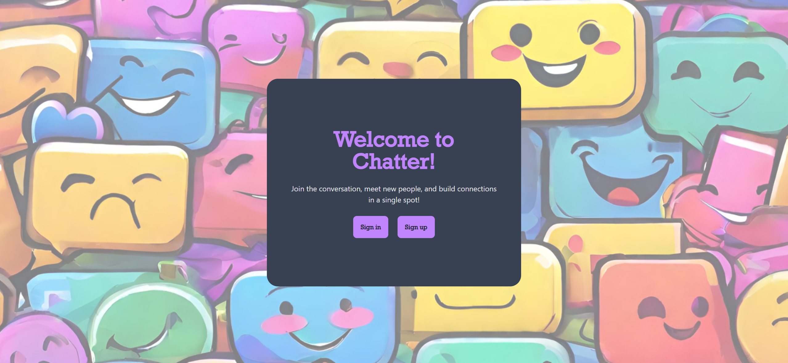
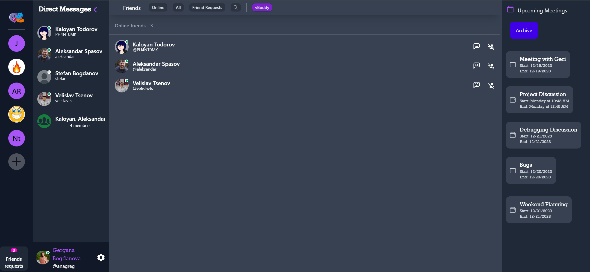
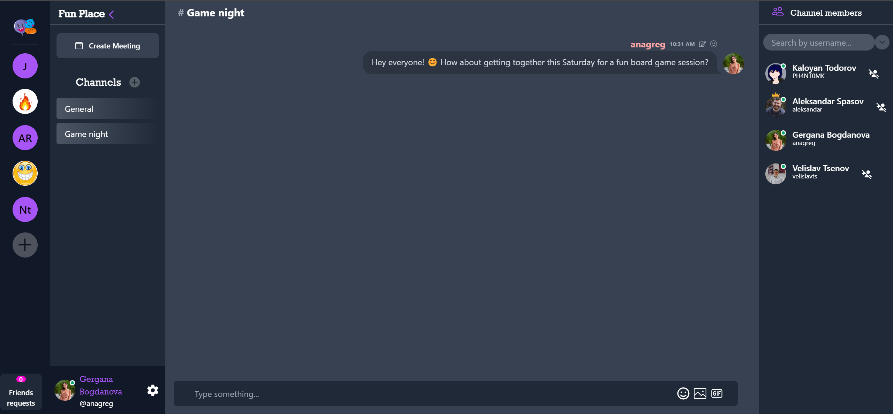
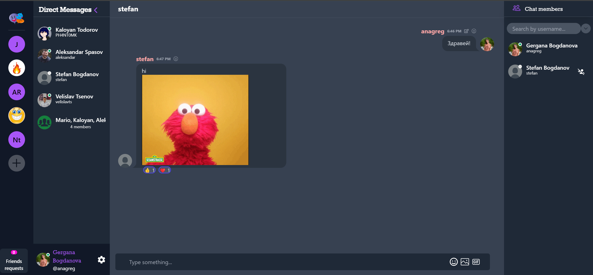
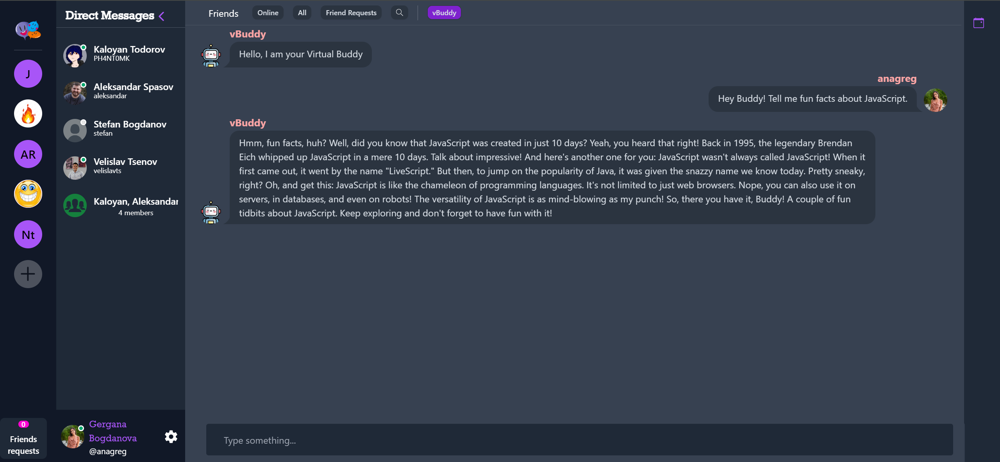
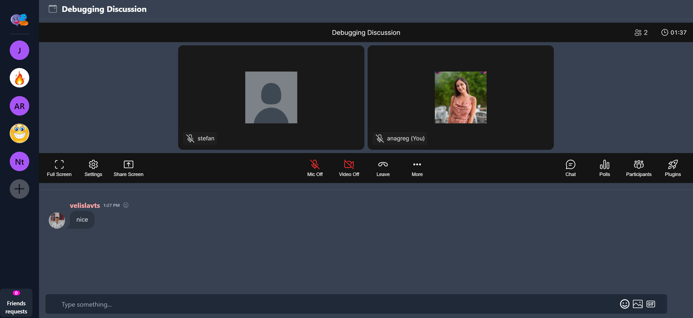
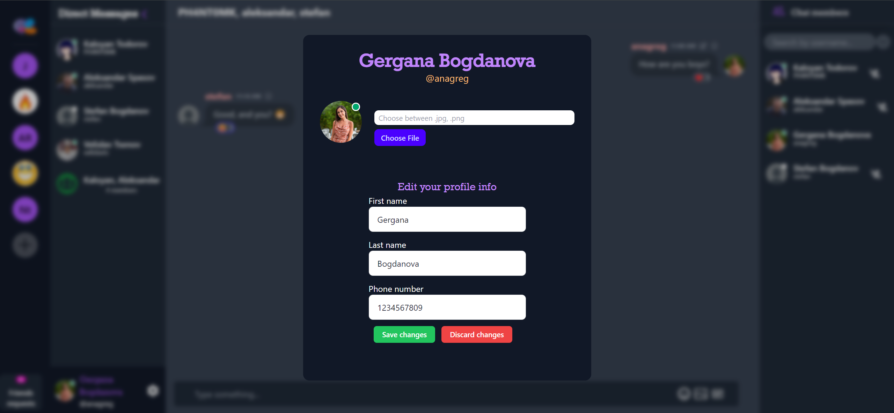

# Chatter


### Description

Introducing Chatter: a contemporary app designed for seamless communication and collaboration among individuals and teams. This user-friendly platform facilitates real-time interaction, enabling users to effortlessly share information, exchange resources, and engage in discussions, including voice and video options.

### Creators

- Aleksandar Spasov - [@alekspasov](https://github.com/alekspasov)
- Gergana Bogdanova - [@banagreg](https://github.com/banagreg)
- Kaloyan Todorov - [@PH4NT0MK](https://github.com/PH4NT0MK)
### Technologies used
- JavaScript
- React
- HTML
- CSS
- Daisy UI
- React Emoji Picker
- Giphy API
- OPENAI API
- Dyte SDK
- Firebase
- ESLint
- git

### Instalation
1. Install the packages
```
npm install
```
2. Run the application
```
npm run dev
```

### Usage

- **Public part**
	<br />The Welcome page offers a visually engaging experience. Navigate effortlessly to access our platform by selecting either the 'Sign In' or 'Sign Up' buttons, tailored to your preference and needs.

    
	<br/>

- **Private part**
	<br />Registered users can login and see a home page with a Teams sidebar, a Direct messages sidebar and a menu, where they can see all their Online friends, All friends, Friend Requests, or search for a new friend. On the right side there is Meetings sidebar with all the upcoming meetings and/or archived meetings.

	
	<br/>

- **Teams and channels**
	<br />Users can create a team, create channels and chat with the members of their team in the channels.Every team have 'General' channel with all team members. 
	<br/>The channels can be public - everybody from this team is able to see it and chat there, or private - only the members of this channel can see it and chat.
	Users have access to a special sidebar with information on current channel members. They can also leave the team or just a specific channel. 
	<br/>Team owners can change the team avatar, the team name and add members to the team.

	
	<br/>

- **Direct messages**
	<br />Users can search for other registered users and start a direct message chat with them. They can add reactions to every message and edit their own messages.
	<br/>The 'Chat members' side bar can be closed, depending on user's preferences.

	
	<br/>

- **Group messages**
	<br />Users can add other users to their direct message chats, making them a group chat. Group chats can have unlimited members. Any user can leave any group chat at any time.

	
	<br/>
- **Virtual buddy messages**
    <br/> Users have the opportunity to use build in AI chat bot - vBuddy. They can ask him various questions and he will be more than happy to provide information and assistance.

    
	<br/>

- **Meetings**
	<br/> Chatter's meetings facilitate real-time communication and collaboration among participants regardless of their location, allowing remote teams or individuals to connect seamlessly.
	- Meetings can be scheduled in advance.
	- Participants can use the meeting chat feature to share messages during the meeting without interrupting the conversation.
	- Meetings support both video and audio conferencing, enabling participants to see and hear each other. Users can turn on or off their cameras and microphones based on their preferences.
	- Meetings can be recorded for future reference or for participants who couldn't attend. This feature captures audio and video.
    <br/>

	

- **Profile**
	<br />Users have a profile panel which enables them to edit their first name, last name and phone number. Users can also change their avatar.
	